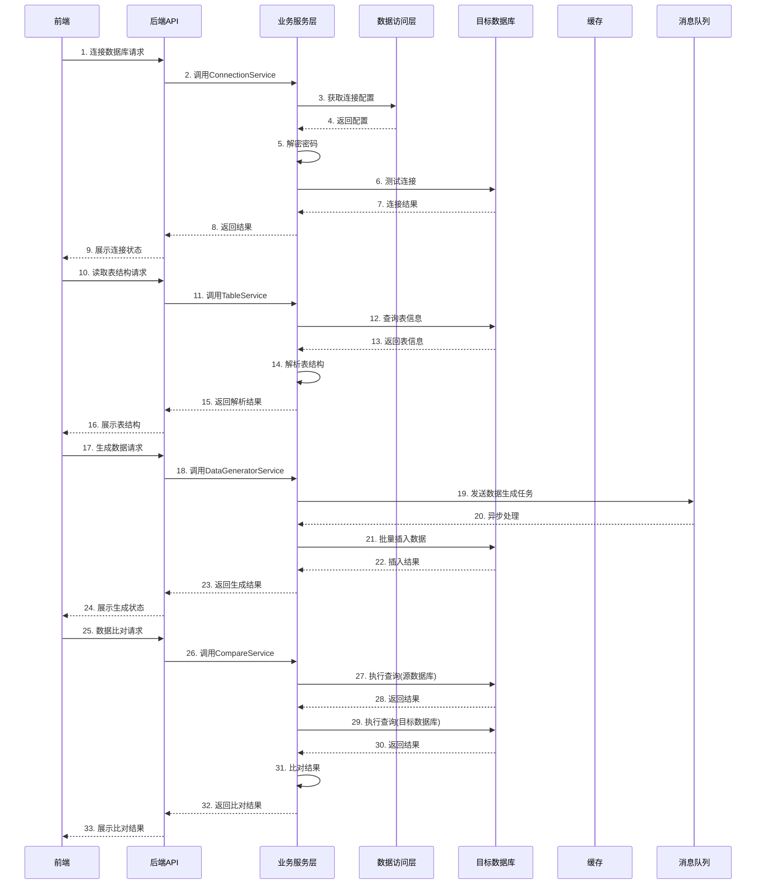
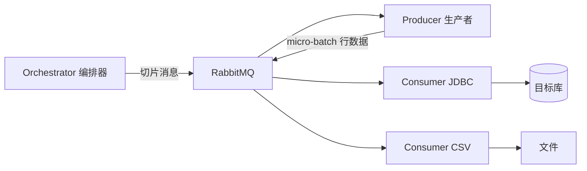

# 数据库测试工具详细设计文档

## 一、技术架构设计

### 1.1 技术选型

| 分类    | 技术              | 版本           | 选型理由                   |
| ----- | --------------- | ------------ | ---------------------- |
| 前端框架  | Vue.js          | 3.x          | 响应式前端框架，组件化开发，生态丰富     |
| 构建工具  | Vite            | 5.x          | 快速的开发服务器和构建工具          |
| 状态管理  | Pinia           | 2.x          | Vue 3 官方推荐的状态管理库       |
| UI组件库 | Element Plus    | 2.x          | 丰富的组件，支持国际化            |
| 代码编辑器 | Monaco Editor   | 0.45.0       | 支持SQL语法高亮和格式化          |
| 后端框架  | Spring Boot     | 3.2.x        | 快速开发，内置Tomcat，依赖管理     |
| 持久层   | MyBatis-Plus    | 3.5.x        | 简化数据库操作，代码生成           |
| 数据库   | H2/MySQL        | 2.1.214/8.0+ | H2用于内嵌存储配置，MySQL用于生产环境 |
| 安全框架  | Spring Security | 6.x          | 提供认证和授权功能              |
| 缓存    | Redis           | 7.0+         | 缓存连接信息和查询结果            |
| 消息队列  | RabbitMQ        | 3.12+        | 异步处理数据生成和比对任务          |
| SQL解析 | JSqlParser      | 4.8+         | 解析SQL语句，提取约束条件         |
| 数据库驱动 | JDBC            | 4.2+         | 支持多数据库连接               |

### 1.2 系统架构

**架构风格：** 前后端分离架构，采用分层设计

**核心流程图：**



## 二、核心模块详细设计

### 2.1 数据库连接管理模块

**功能描述：** 管理数据库连接配置，支持多种数据库类型的连接

**设计模式：** 工厂模式、策略模式、单例模式

**核心类设计：**

| 类名                           | 职责             | 设计模式 | 属性                                                                             | 方法                                                                                                                      |
| ---------------------------- | -------------- | ---- | ------------------------------------------------------------------------------ | ----------------------------------------------------------------------------------------------------------------------- |
| `ConnectionManager`          | 连接管理           | 单例模式 | `Map<String, DataSource> dataSources`                                          | `getDataSource(String connectionId)`, `testConnection(ConnectionConfig config)`, `closeDataSource(String connectionId)` |
| `ConnectionFactory`          | 连接工厂           | 工厂模式 | -                                                                              | `createDataSource(ConnectionConfig config)`, `getDriverClass(String dbType)`                                            |
| `ConnectionConfig`           | 连接配置           | -    | `id`, `name`, `dbType`, `host`, `port`, `databaseName`, `username`, `password` | `getJdbcUrl()`, `encryptPassword()`, `decryptPassword()`                                                                |
| `ConnectionStrategy`         | 连接策略           | 策略模式 | -                                                                              | `connect(ConnectionConfig config)`, `getJdbcUrl(ConnectionConfig config)`                                               |
| `MysqlConnectionStrategy`    | MySQL连接策略      | 策略模式 | -                                                                              | `connect(ConnectionConfig config)`, `getJdbcUrl(ConnectionConfig config)`                                               |
| `OracleConnectionStrategy`   | Oracle连接策略     | 策略模式 | -                                                                              | `connect(ConnectionConfig config)`, `getJdbcUrl(ConnectionConfig config)`                                               |
| `PostgresConnectionStrategy` | PostgreSQL连接策略 | 策略模式 | -                                                                              | `connect(ConnectionConfig config)`, `getJdbcUrl(ConnectionConfig config)`                                               |
| `GoldenDbConnectionStrategy` | GoldenDB连接策略   | 策略模式 | -                                                                              | `connect(ConnectionConfig config)`, `getJdbcUrl(ConnectionConfig config)`                                               |

**算法设计：**
- **连接池管理算法**：使用HikariCP连接池，根据数据库类型和连接参数动态配置池大小
- **密码加密算法**：使用AES-256加密算法，密钥存储在环境变量中
- **连接测试算法**：根据不同数据库类型执行对应的探活语句：
  - MySQL：`SELECT 1`
  - Oracle：`SELECT 1 FROM DUAL`
  - PostgreSQL：`SELECT 1`
  - GoldenDB：`SELECT 1`（与MySQL兼容）
  - 其他数据库：使用数据库特定的探活语句

**配置存储：**

- 使用H2内存数据库存储连接配置
- 密码使用AES加密存储
- 支持导入/导出连接配置（JSON格式）

### 2.2 表结构解析模块

**功能描述：** 通过查询数据库元数据获取表结构和约束信息，支持DDL语句解析作为补充

**设计模式：** 策略模式、适配器模式

**核心类设计：**

| 类名                     | 职责      | 设计模式  | 属性                                                                                    | 方法                                                                                                                      |
| ---------------------- | ------- | ----- | ------------------------------------------------------------------------------------- | ----------------------------------------------------------------------------------------------------------------------- |
| `TableMetadataParser`  | 表元数据解析  | 策略模式  | -                                                                                     | `parseTableStructure(Connection connection, String tableName)`, `parseAllTables(Connection connection)`, `getTableMetadata(Connection connection, String tableName)` |
| `MetadataStrategy`     | 元数据查询策略 | 策略模式  | -                                                                                     | `getTables(Connection connection)`, `getColumns(Connection connection, String tableName)`, `getConstraints(Connection connection, String tableName)` |
| `StandardMetadataStrategy` | 标准元数据策略 | 策略模式  | -                                                                                     | `getTables(Connection connection)`, `getColumns(Connection connection, String tableName)`, `getConstraints(Connection connection, String tableName)` |
| `OracleMetadataStrategy` | Oracle元数据策略 | 策略模式  | -                                                                                     | `getTables(Connection connection)`, `getColumns(Connection connection, String tableName)`, `getConstraints(Connection connection, String tableName)` |
| `DDLParser`            | DDL解析   | 适配器模式 | -                                                                                     | `parseDDL(String ddl)`, `extractTableInfo(String ddl)`                                                                  |
| `DataTypeMapper`       | 数据类型映射  | -     | `Map<String, DataType> typeMap`                                                       | `mapDataType(String dbType, String columnType)`, `getJavaType(String dbType)`                                           |
| `TableInfo`            | 表信息     | -     | `tableName`, `columns`, `constraints`, `tableComment`                                 | `addColumn(ColumnInfo column)`, `addConstraint(ConstraintInfo constraint)`                                              |
| `ColumnInfo`           | 字段信息    | -     | `columnName`, `dataType`, `columnSize`, `nullable`, `columnComment`, `defaultValue`   | -                                                                                                                       |
| `ConstraintInfo`       | 约束信息    | -     | `constraintName`, `constraintType`, `columns`, `referencedTable`, `referencedColumns` | -                                                                                                                       |

**算法设计：**

- **元数据查询算法**：
  1. 连接数据库
  2. 根据数据库类型选择合适的元数据查询策略
  3. 查询表信息（`INFORMATION_SCHEMA.TABLES`或数据库特定视图）
  4. 查询字段信息（`INFORMATION_SCHEMA.COLUMNS`或数据库特定视图）
  5. 查询约束信息（`INFORMATION_SCHEMA.KEY_COLUMN_USAGE`、`INFORMATION_SCHEMA.TABLE_CONSTRAINTS`或数据库特定视图）
  6. 构建表结构模型
- **DDL解析算法**（作为补充）：
  1. 使用JSqlParser解析DDL语句
  2. 提取表名、字段定义、约束定义
  3. 构建表结构模型

### 2.3 数据生成模块

**功能描述：** 根据表结构和约束生成测试数据

**设计模式：** 策略模式、工厂模式、模板方法模式

**核心类设计：**

| 类名                      | 职责      | 设计模式   | 属性              | 方法                                                                                                                                                               |
| ----------------------- | ------- | ------ | --------------- | ---------------------------------------------------------------------------------------------------------------------------------------------------------------- |
| `DataGenerator`         | 数据生成    | 模板方法模式 | -               | `generate(TableInfo tableInfo, int rowCount)`, `generateRow(TableInfo tableInfo)`, `applyConstraints(List<ConstraintInfo> constraints, Map<String, Object> row)` |
| `FieldGeneratorFactory` | 字段生成工厂  | 工厂模式   | -               | `getGenerator(String dataType)`, `registerGenerator(String dataType, FieldGenerator generator)`                                                                  |
| `FieldGenerator`        | 字段生成器   | 策略模式   | -               | `generate(ColumnInfo column, List<ConstraintInfo> constraints)`                                                                                                  |
| `IntegerGenerator`      | 整数生成器   | 策略模式   | -               | `generate(ColumnInfo column, List<ConstraintInfo> constraints)`                                                                                                  |
| `StringGenerator`       | 字符串生成器  | 策略模式   | -               | `generate(ColumnInfo column, List<ConstraintInfo> constraints)`                                                                                                  |
| `DateTimeGenerator`     | 日期时间生成器 | 策略模式   | -               | `generate(ColumnInfo column, List<ConstraintInfo> constraints)`                                                                                                  |
| `BooleanGenerator`      | 布尔生成器   | 策略模式   | -               | `generate(ColumnInfo column, List<ConstraintInfo> constraints)`                                                                                                  |
| `BatchInsertService`    | 批量插入    | -      | `int batchSize` | `batchInsert(Connection connection, String tableName, List<Map<String, Object>> data)`, `generateInsertSQL(String tableName, Map<String, Object> row)`           |

**算法设计：**

- **数据生成算法**：
  1. 分析表结构和约束
  2. 为每个字段选择合适的生成器
  3. 生成数据行
  4. 应用约束规则调整数据
  5. 批量插入数据库
- **约束应用算法**：
  1. 主键约束：生成唯一值
  2. 外键约束：从引用表获取有效值
  3. 唯一约束：确保值唯一
  4. 非空约束：确保值非空
  5. 检查约束：生成符合条件的值
  6. 自定义约束：应用自定义规则

### 2.4 自定义约束生成模块

**功能描述：** 基于 JSqlParser 返回的 Select AST 提取约束，并映射为统一约束模型供数据生成模块使用

**设计模式：** 访问者模式、观察者模式

**核心类设计：**

| 类名                    | 职责      | 设计模式  | 属性                                                                 | 方法                                                                                                                                                                                                 |
| --------------------- | ------- | ----- | ------------------------------------------------------------------ | -------------------------------------------------------------------------------------------------------------------------------------------------------------------------------------------------- |
| `SqlAstExtractor`     | AST提取器   | 访问者模式 | -                                                                  | `extract(Select select)`, `visitPlainSelect(PlainSelect plainSelect)`, `visitSetOperation(SetOperationList setOp)`                                                                                   |
| `SqlSemanticAnalyzer` | SQL语义分析 | 访问者模式 | -                                                                  | `analyzeSelect(Select select)`, `analyzeFrom(FromItem fromItem)`, `analyzeWhere(Expression where)`, `analyzeJoin(Join join)`, `analyzeUnion(SetOperationList union)`                                 |
| `AliasResolver`       | 别名解析   | -     | `Map<String, String> columnAliases`, `Map<String, String> tableAliases` | `resolveColumnAlias(String alias)`, `resolveTableAlias(String alias)`, `buildAliasMap(Select select)`                                                                                                |
| `SubqueryAnalyzer`    | 子查询分析  | -     | -                                                                  | `analyzeSubquery(SubSelect subSelect)`, `extractSubqueryColumns(SubSelect subSelect)`, `resolveSubqueryReferences(SubSelect subSelect, Map<String, String> outerAliases)`                             |
| `ConstraintModelBuilder` | 约束模型构建 | -     | -                                                                  | `build(SqlAstContext context)`, `buildColumnConstraints()`, `buildJoinConstraints()`, `buildGroupConstraints()`                                                                                     |
| `ConstraintMerger`    | 约束合并    | -     | -                                                                  | `merge(List<Constraint> sqlConstraints, List<Constraint> tableConstraints)`, `detectConflict()`, `resolveConflict()`                                                                                 |
| `ConstraintManager`   | 约束管理    | 单例模式  | `List<CustomConstraint> constraints`                               | `saveConstraint(CustomConstraint constraint)`, `loadConstraint(long id)`, `deleteConstraint(long id)`                                                                                              |
| `ConstraintApplier`   | 约束应用    | 观察者模式 | -                                                                  | `applyConstraint(CustomConstraint constraint, Map<String, Object> row)`, `registerObserver(ConstraintObserver observer)`                                                                             |
| `CustomConstraint`    | 自定义约束   | -     | `id`, `name`, `type`, `sqlStatement`, `constraintRule`, `priority` | `getRule()`, `apply(Map<String, Object> row)`                                                                                                                                                      |
| `RangeConstraint`     | 范围约束    | -     | `columnName`, `minValue`, `maxValue`                               | `apply(Map<String, Object> row)`                                                                                                                                                                   |
| `EqualityConstraint`  | 等值约束    | -     | `columnName`, `values`, `pattern`                                  | `apply(Map<String, Object> row)`                                                                                                                                                                   |
| `RelationConstraint`  | 关联约束    | -     | `sourceColumn`, `targetTable`, `targetColumn`                      | `apply(Map<String, Object> row)`                                                                                                                                                                   |
| `Condition`           | 条件表达式   | -     | `leftOperand`, `operator`, `rightOperand`, `type`                  | `evaluate(Map<String, Object> row)`                                                                                                                                                                |
| `JoinCondition`       | JOIN条件   | -     | `leftTable`, `leftColumn`, `rightTable`, `rightColumn`, `operator` | `evaluate(Map<String, Object> row)`                                                                                                                                                                |

**算法设计：**

- **AST解析算法（推荐实现）**：
  1. 使用 JSqlParser 将 SQL 解析为 `Select` 对象（即 AST 根节点）
  2. 通过 Visitor 遍历 `FROM`、`WHERE`、`JOIN`、`GROUP BY`、`HAVING`、`UNION`
  3. 构建表/列别名映射并解析列归属
  4. 递归处理子查询并合并作用域上下文
  5. 将提取结果写入统一约束中间模型（Constraint IR）
- **语义分析算法**：
  1. 解析列引用：识别列所属的表
  2. 解析别名：处理列别名和表别名
  3. 处理子查询：分析子查询的列引用和作用域
  4. 处理JOIN条件：识别表间的关联关系
- **约束提取与合并算法**：
  1. 从 AST 中提取范围、等值、枚举、关联、分组等 SQL 约束
  2. 拉取表自身约束（PK/FK/UNIQUE/NOT NULL/CHECK）
  3. 在统一模型中执行约束求交与冲突检测
  4. 输出可执行约束集给数据生成模块
- **约束应用算法**：
  1. 范围约束：生成范围内的值
  2. 等值约束：从指定值或模式中选择
  3. 关联约束：从关联表获取匹配值

**复杂场景处理：**

1. **基本查询**：`SELECT a FROM t1`
   - 识别列a属于表t1
   - 生成表t1的a列的约束

2. **列别名**：`SELECT a AS b FROM t1 WHERE b = 1`
   - 识别b是a的别名
   - 解析WHERE条件为t1.a = 1
   - 生成表t1的a列的等值约束

3. **子查询**：`SELECT * FROM (SELECT a FROM t1) temp1`
   - 递归解析子查询
   - 识别temp1表的a列来源于t1表
   - 处理子查询的列引用

4. **UNION操作**：`SELECT a FROM t1 UNION SELECT b FROM t2`
   - 分别解析每个SELECT语句
   - 合并列信息
   - 生成适用于两个表的约束

5. **多表JOIN**：`SELECT * FROM t1 JOIN t2 ON t1.id = t2.id`
   - 解析JOIN条件
   - 识别t1.id与t2.id的关联关系
   - 生成关联约束

6. **复杂嵌套**：`SELECT * FROM (SELECT a FROM t1 UNION SELECT b FROM t2) temp1 LEFT JOIN (SELECT a FROM t3 UNION SELECT b FROM t4) temp2 ON temp1.b = temp2.b`
   - 递归解析子查询和UNION操作
   - 解析LEFT JOIN条件
   - 识别temp1.b与temp2.b的关联关系
   - 生成关联约束，确保t1.b、t2.b与t3.b、t4.b匹配

7. **函数调用**：`SELECT CONCAT(first_name, ' ', last_name) AS full_name FROM users`
   - 识别函数调用
   - 解析函数参数中的列引用
   - 生成基础列的约束

8. **聚合函数**：`SELECT department, COUNT(*) AS employee_count FROM employees GROUP BY department`
   - 识别聚合函数
   - 解析GROUP BY子句
   - 生成分组列的约束

9. **窗口函数**：`SELECT *, ROW_NUMBER() OVER (PARTITION BY department ORDER BY salary DESC) AS rank FROM employees`
   - 识别窗口函数
   - 解析PARTITION BY和ORDER BY子句
   - 生成相关列的约束

10. **复杂条件**：`SELECT * FROM orders WHERE (status = 'completed' AND total > 1000) OR (status = 'pending' AND created_at > '2023-01-01')`
    - 解析逻辑运算符（AND/OR）
    - 处理括号优先级
    - 生成多个条件的约束

11. **子查询作为条件**：`SELECT * FROM users WHERE id IN (SELECT user_id FROM orders WHERE total > 1000)`
    - 解析IN子句中的子查询
    - 识别外层表和内层表的关系
    - 生成关联约束

12. **自连接**：`SELECT e1.name AS employee, e2.name AS manager FROM employees e1 JOIN employees e2 ON e1.manager_id = e2.id`
    - 识别自连接
    - 解析表别名（e1、e2）
    - 生成关联约束

13. **外连接**：`SELECT * FROM employees LEFT JOIN departments ON employees.department_id = departments.id`
    - 识别外连接类型（LEFT JOIN）
    - 解析连接条件
    - 处理可能的NULL值情况

14. **复杂表达式**：`SELECT id, (price * quantity) + (price * quantity * tax_rate) AS total FROM orders`
    - 解析算术表达式
    - 识别表达式中的列引用
    - 生成基础列的约束

15. **子查询作为列**：`SELECT id, name, (SELECT COUNT(*) FROM orders WHERE user_id = users.id) AS order_count FROM users`
    - 解析子查询作为列的情况
    - 识别子查询与外层表的关联
    - 生成关联约束

16. **复杂JOIN条件**：`SELECT * FROM table1 JOIN table2 ON table1.id = table2.id AND table1.status = table2.status`
    - 解析多条件JOIN
    - 识别多个关联关系
    - 生成多个关联约束

17. **带排序和限制**：`SELECT * FROM users ORDER BY created_at DESC LIMIT 10`
    - 解析ORDER BY子句
    - 解析LIMIT子句
    - 生成排序列的约束

18. **带DISTINCT**：`SELECT DISTINCT department FROM employees`
    - 识别DISTINCT关键字
    - 生成去重列的约束

19. **带HAVING**：`SELECT department, COUNT(*) AS count FROM employees GROUP BY department HAVING COUNT(*) > 5`
    - 解析HAVING子句
    - 识别聚合条件
    - 生成分组和聚合约束

20. **多表复杂关联**：`SELECT * FROM orders o JOIN order_items oi ON o.id = oi.order_id JOIN products p ON oi.product_id = p.id WHERE o.status = 'completed'`
    - 解析多表关联
    - 处理链式JOIN条件
    - 生成多个关联约束

### 2.5 数据比对模块

**功能描述：** 比对两个数据库的查询结果和性能

**设计模式：** 策略模式、模板方法模式

**核心类设计：**

| 类名                  | 职责   | 设计模式   | 属性                                                                                       | 方法                                                                                                                                                                         |
| ------------------- | ---- | ------ | ---------------------------------------------------------------------------------------- | -------------------------------------------------------------------------------------------------------------------------------------------------------------------------- |
| `DataComparator`    | 数据比对 | 模板方法模式 | -                                                                                        | `compare(Connection sourceConn, Connection targetConn, String sql)`, `executeQuery(Connection conn, String sql)`, `compareResults(ResultSet sourceRs, ResultSet targetRs)` |
| `ResultComparator`  | 结果比对 | 策略模式   | -                                                                                        | `compare(ResultSet sourceRs, ResultSet targetRs)`, `compareRow(Map<String, Object> sourceRow, Map<String, Object> targetRow)`                                              |
| `PerformanceTester` | 性能测试 | -      | `int executionCount`                                                                     | `testPerformance(Connection conn, String sql)`, `executeWithTimer(Connection conn, String sql)`                                                                            |
| `SyncDataService`   | 数据同步 | -      | -                                                                                        | `syncData(Connection sourceConn, Connection targetConn, String tableName, List<Map<String, Object>> data)`                                                                 |
| `ResultAnalyzer`    | 结果分析 | -      | -                                                                                        | `analyzeComparisonResult(ComparisonResult result)`, `generateReport(ComparisonResult result, PerformanceResult perfResult)`                                                |
| `ComparisonResult`  | 比对结果 | -      | `rowCountMatch`, `contentMatch`, `columnStructureMatch`, `differences`                   | -                                                                                                                                                                          |
| `PerformanceResult` | 性能结果 | -      | `sourceExecutionTimes`, `targetExecutionTimes`, `sourceAverageTime`, `targetAverageTime` | -                                                                                                                                                                          |

**算法设计：**

- **数据比对算法**：
  1. 分别执行查询获取结果集
  2. 比对结果集行数
  3. 比对结果集列结构
  4. 逐行比对数据内容
  5. 处理NULL值和浮点数精度
- **性能测试算法**：
  1. 执行查询多次（默认3次）
  2. 记录每次执行时间
  3. 计算平均值、最小值、最大值
  4. 生成性能报告

### 2.6 辅助功能模块

**功能描述：** 提供SQL执行、数据导出等辅助功能

**设计模式：** 适配器模式、命令模式

**核心类设计：**

| 类名               | 职责      | 设计模式  | 属性                                        | 方法                                                                                                                                                       |
| ---------------- | ------- | ----- | ----------------------------------------- | -------------------------------------------------------------------------------------------------------------------------------------------------------- |
| `SqlExecutor`    | SQL执行   | 命令模式  | -                                         | `execute(Connection connection, String sql)`, `executeQuery(Connection connection, String sql)`, `executeUpdate(Connection connection, String sql)`      |
| `SqlFormatter`   | SQL格式化  | -     | -                                         | `format(String sql)`, `parseAndFormat(String sql)`                                                                                                       |
| `DataExporter`   | 数据导出    | 适配器模式 | -                                         | `export(Connection connection, String tableName, String format)`, `exportToCsv(ResultSet rs)`, `exportToJson(ResultSet rs)`, `exportToSql(ResultSet rs)` |
| `ProjectManager` | 项目管理    | -     | -                                         | `saveProject(ProjectConfig project)`, `loadProject(long id)`, `exportProject(long id)`, `importProject(byte[] data)`                                     |
| `SqlHistory`     | SQL历史记录 | -     | `List<SqlRecord> history`                 | `addRecord(String sql, long executionTime)`, `getRecentRecords(int limit)`                                                                               |
| `SqlRecord`      | SQL记录   | -     | `id`, `sql`, `executionTime`, `timestamp` | -                                                                                                                                                        |
| `ProjectConfig`  | 项目配置    | -     | `id`, `name`, `description`, `configData` | -                                                                                                                                                        |

**算法设计：**

- **SQL执行算法**：
  1. 解析SQL语句类型
  2. 执行相应类型的SQL
  3. 处理结果集或更新计数
  4. 记录执行时间和结果
- **数据导出算法**：
  1. 执行查询获取结果集
  2. 根据格式选择导出适配器
  3. 转换结果集为指定格式
  4. 生成导出文件

## 三、数据库设计

### 3.1 系统配置数据库

**`connection_config`表**

| 字段名             | 数据类型           | 约束                                                      | 描述     |
| --------------- | -------------- | ------------------------------------------------------- | ------ |
| `id`            | `BIGINT`       | `PRIMARY KEY AUTO_INCREMENT`                            | 连接ID   |
| `name`          | `VARCHAR(100)` | `NOT NULL`                                              | 连接名称   |
| `db_type`       | `VARCHAR(50)`  | `NOT NULL`                                              | 数据库类型  |
| `host`          | `VARCHAR(255)` | `NOT NULL`                                              | 主机地址   |
| `port`          | `INT`          | `NOT NULL`                                              | 端口号    |
| `database_name` | `VARCHAR(100)` | `NOT NULL`                                              | 数据库名称  |
| `username`      | `VARCHAR(100)` | `NOT NULL`                                              | 用户名    |
| `password`      | `VARCHAR(255)` | `NOT NULL`                                              | 加密后的密码 |
| `driver_class`  | `VARCHAR(255)` | `NOT NULL`                                              | 驱动类名   |
| `url_template`  | `VARCHAR(255)` | `NOT NULL`                                              | URL模板  |
| `created_at`    | `TIMESTAMP`    | `DEFAULT CURRENT_TIMESTAMP`                             | 创建时间   |
| `updated_at`    | `TIMESTAMP`    | `DEFAULT CURRENT_TIMESTAMP ON UPDATE CURRENT_TIMESTAMP` | 更新时间   |

**`custom_constraint`表**

| 字段名               | 数据类型           | 约束                                                      | 描述              |
| ----------------- | -------------- | ------------------------------------------------------- | --------------- |
| `id`              | `BIGINT`       | `PRIMARY KEY AUTO_INCREMENT`                            | 约束ID            |
| `name`            | `VARCHAR(100)` | `NOT NULL`                                              | 约束名称            |
| `type`            | `VARCHAR(50)`  | `NOT NULL`                                              | 约束类型            |
| `sql_statement`   | `TEXT`         | `NOT NULL`                                              | 原始SQL语句         |
| `constraint_rule` | `TEXT`         | `NOT NULL`                                              | 生成的约束规则（JSON格式） |
| `priority`        | `INT`          | `DEFAULT 0`                                             | 约束优先级           |
| `created_at`      | `TIMESTAMP`    | `DEFAULT CURRENT_TIMESTAMP`                             | 创建时间            |
| `updated_at`      | `TIMESTAMP`    | `DEFAULT CURRENT_TIMESTAMP ON UPDATE CURRENT_TIMESTAMP` | 更新时间            |

**`project_config`表**

| 字段名           | 数据类型           | 约束                                                      | 描述             |
| ------------- | -------------- | ------------------------------------------------------- | -------------- |
| `id`          | `BIGINT`       | `PRIMARY KEY AUTO_INCREMENT`                            | 项目ID           |
| `name`        | `VARCHAR(100)` | `NOT NULL`                                              | 项目名称           |
| `description` | `TEXT`         | <br />                                                  | 项目描述           |
| `config_data` | `TEXT`         | <br />                                                  | 项目配置数据（JSON格式） |
| `created_at`  | `TIMESTAMP`    | `DEFAULT CURRENT_TIMESTAMP`                             | 创建时间           |
| `updated_at`  | `TIMESTAMP`    | `DEFAULT CURRENT_TIMESTAMP ON UPDATE CURRENT_TIMESTAMP` | 更新时间           |

**`sql_history`表**

| 字段名              | 数据类型        | 约束                           | 描述       |
| ---------------- | ----------- | ---------------------------- | -------- |
| `id`             | `BIGINT`    | `PRIMARY KEY AUTO_INCREMENT` | 历史记录ID   |
| `sql`            | `TEXT`      | `NOT NULL`                   | SQL语句    |
| `execution_time` | `BIGINT`    | `NOT NULL`                   | 执行时间（毫秒） |
| `success`        | `BOOLEAN`   | `DEFAULT TRUE`               | 是否执行成功   |
| `error_message`  | `TEXT`      | <br />                       | 错误信息     |
| `created_at`     | `TIMESTAMP` | `DEFAULT CURRENT_TIMESTAMP`  | 执行时间     |

## 四、前端设计

### 4.1 页面结构

**主布局：**

- 顶部导航栏：系统标题、用户信息、帮助
- 左侧菜单：连接管理、表结构、数据生成、自定义约束、数据比对、设置
- 右侧主内容区：根据选择的菜单显示对应内容
- 底部状态栏：连接状态、操作进度

**核心页面：**

1. **连接管理页面**
   - 连接列表（表格展示）
   - 添加/编辑连接表单
   - 连接测试按钮
   - 导入/导出连接配置
2. **表结构页面**
   - 数据库选择下拉框
   - 表列表
   - 字段详情（表格展示）
   - 约束详情
   - DDL预览
3. **数据生成页面**
   - 表选择
   - 字段配置（生成规则设置）
   - 生成数量设置
   - 数据预览
   - 执行生成按钮
4. **自定义约束页面**
   - SQL编辑器（支持语法高亮）
   - 约束解析结果展示
   - 约束管理（保存、编辑、删除）
   - 应用到数据生成
5. **数据比对页面**
   - 数据库选择（两个数据库）
   - SQL编辑器
   - 执行比对按钮
   - 结果展示（差异高亮）
   - 性能对比图表
6. **设置页面**
   - 系统设置
   - 驱动管理
   - 模板管理

### 4.2 组件设计

| 组件名                   | 功能     | 说明                       | 关键属性                                          | 关键方法                                                      |
| --------------------- | ------ | ------------------------ | --------------------------------------------- | --------------------------------------------------------- |
| `ConnectionForm`      | 连接配置表单 | 用于添加/编辑数据库连接             | `connection`, `dbTypes`                       | `validate()`, `submit()`, `testConnection()`              |
| `SqlEditor`           | SQL编辑器 | 基于Monaco Editor实现，支持语法高亮 | `value`, `language`, `readOnly`               | `getValue()`, `setValue()`, `format()`                    |
| `TableStructure`      | 表结构展示  | 展示表的字段和约束信息              | `tableName`, `columns`, `constraints`         | `loadTable()`, `refresh()`, `exportDDL()`                 |
| `DataGeneratorConfig` | 数据生成配置 | 配置数据生成规则                 | `tableName`, `columns`, `rowCount`            | `generatePreview()`, `executeGenerate()`, `resetConfig()` |
| `ConstraintParser`    | 约束解析器  | 解析查询语句生成约束               | `sql`, `constraints`                          | `parseSql()`, `saveConstraint()`, `applyConstraint()`     |
| `DataComparator`      | 数据比对器  | 展示比对结果和差异                | `sourceConnection`, `targetConnection`, `sql` | `executeCompare()`, `exportReport()`, `clearResults()`    |
| `PerformanceChart`    | 性能图表   | 展示性能对比数据                 | `performanceData`                             | `renderChart()`, `updateData()`                           |
| `ProgressBar`         | 进度条    | 显示操作进度                   | `value`, `message`                            | `setProgress()`, `reset()`, `complete()`                  |

### 4.3 状态管理

**Pinia Store设计：**

| Store                | 功能    | 状态                                                                                                                                                 | Actions                                                                                                          | Getters                                      |
| -------------------- | ----- | -------------------------------------------------------------------------------------------------------------------------------------------------- | ---------------------------------------------------------------------------------------------------------------- | -------------------------------------------- |
| `connectionStore`    | 连接管理  | `connections: Array`, `currentConnection: Object`                                                                                                  | `fetchConnections()`, `addConnection()`, `updateConnection()`, `deleteConnection()`, `testConnection()`          | `getConnectionById()`                        |
| `tableStore`         | 表结构管理 | `tables: Array`, `currentTable: Object`, `columns: Array`, `constraints: Array`                                                                    | `fetchTables()`, `fetchTableDetails()`, `parseDDL()`                                                             | `getColumnByName()`, `getConstraintByName()` |
| `dataGeneratorStore` | 数据生成  | `tableName: String`, `columnConfigs: Object`, `rowCount: Number`, `generatedData: Array`, `progress: Number`                                       | `setTable()`, `configureColumn()`, `generatePreview()`, `executeGenerate()`, `resetConfig()`                     | `isConfigValid()`                            |
| `constraintStore`    | 约束管理  | `constraints: Array`, `currentConstraint: Object`, `parsedResult: Object`                                                                          | `fetchConstraints()`, `parseSql()`, `saveConstraint()`, `updateConstraint()`, `deleteConstraint()`               | `getConstraintById()`                        |
| `comparatorStore`    | 数据比对  | `sourceConnection: Object`, `targetConnection: Object`, `sql: String`, `comparisonResult: Object`, `performanceResult: Object`, `progress: Number` | `setConnections()`, `setSql()`, `executeCompare()`, `syncData()`, `exportReport()`                               | `isComparisonValid()`                        |
| `projectStore`       | 项目管理  | `projects: Array`, `currentProject: Object`                                                                                                        | `fetchProjects()`, `createProject()`, `updateProject()`, `deleteProject()`, `exportProject()`, `importProject()` | `getProjectById()`                           |

## 五、API设计

### 5.1 连接管理API

| API路径                     | 方法       | 功能     | 请求体                                                                                      | 响应体                                                                   |
| ------------------------- | -------- | ------ | ---------------------------------------------------------------------------------------- | --------------------------------------------------------------------- |
| `/api/connections`        | `GET`    | 获取连接列表 | N/A                                                                                      | `[{id, name, dbType, host, port, databaseName, username, createdAt}]` |
| `/api/connections`        | `POST`   | 添加连接   | `{name, dbType, host, port, databaseName, username, password, driverClass, urlTemplate}` | `{id, name, dbType, host, port, databaseName, username, createdAt}`   |
| `/api/connections/{id}`   | `PUT`    | 更新连接   | `{name, dbType, host, port, databaseName, username, password, driverClass, urlTemplate}` | `{id, name, dbType, host, port, databaseName, username, updatedAt}`   |
| `/api/connections/{id}`   | `DELETE` | 删除连接   | N/A                                                                                      | `{success: true}`                                                     |
| `/api/connections/test`   | `POST`   | 测试连接   | `{dbType, host, port, databaseName, username, password, driverClass, urlTemplate}`       | `{success: true, message: "连接成功"}`                                    |
| `/api/connections/export` | `GET`    | 导出连接配置 | N/A                                                                                      | 文件流                                                                   |
| `/api/connections/import` | `POST`   | 导入连接配置 | 文件                                                                                       | `{success: true, imported: 5}`                                        |

### 5.2 表结构API

| API路径                                 | 方法     | 功能      | 请求体     | 响应体                                                                               |
| ------------------------------------- | ------ | ------- | ------- | --------------------------------------------------------------------------------- |
| `/api/tables`                         | `GET`  | 获取表列表   | N/A     | `[{tableName, tableComment}]`                                                     |
| `/api/tables/{tableName}/columns`     | `GET`  | 获取表字段信息 | N/A     | `[{columnName, dataType, columnSize, nullable, columnComment, defaultValue}]`     |
| `/api/tables/{tableName}/constraints` | `GET`  | 获取表约束信息 | N/A     | `[{constraintName, constraintType, columns, referencedTable, referencedColumns}]` |
| `/api/tables/ddl`                     | `POST` | 解析DDL语句 | `{ddl}` | `{tableName, columns, constraints}`                                               |
| `/api/tables/{tableName}/ddl`         | `GET`  | 获取表DDL  | N/A     | `{ddl: "CREATE TABLE ..."}`                                                       |

### 5.3 数据生成API

| API路径                    | 方法     | 功能      | 请求体                                                                      | 响应体                                                      |
| ------------------------ | ------ | ------- | ------------------------------------------------------------------------ | -------------------------------------------------------- |
| `/api/generate/data`     | `POST` | 生成数据    | `{connectionId, tableName, columnConfigs, rowCount, generateSql: false}` | `{success: true, generatedRows: 100, message: "数据生成成功"}` |
| `/api/generate/sql`      | `POST` | 生成SQL语句 | `{connectionId, tableName, columnConfigs, rowCount}`                     | `{sql: "INSERT INTO ..."}`                               |
| `/api/generate/preview`  | `POST` | 预览生成数据  | `{connectionId, tableName, columnConfigs, rowCount: 10}`                 | `{data: [{...}]}`                                        |
| `/api/generate/progress` | `GET`  | 获取生成进度  | `{taskId}`                                                               | `{progress: 75, status: "running"}`                      |

### 5.4 自定义约束API

| API路径                         | 方法       | 功能        | 请求体                                   | 响应体                                                                   |
| ----------------------------- | -------- | --------- | ------------------------------------- | --------------------------------------------------------------------- |
| `/api/constraints`            | `GET`    | 获取自定义约束列表 | N/A                                   | `[{id, name, type, sqlStatement, priority, createdAt}]`               |
| `/api/constraints`            | `POST`   | 添加自定义约束   | `{name, sqlStatement, priority}`      | `{id, name, type, sqlStatement, constraintRule, priority, createdAt}` |
| `/api/constraints/{id}`       | `PUT`    | 更新自定义约束   | `{name, sqlStatement, priority}`      | `{id, name, type, sqlStatement, constraintRule, priority, updatedAt}` |
| `/api/constraints/{id}`       | `DELETE` | 删除自定义约束   | N/A                                   | `{success: true}`                                                     |
| `/api/constraints/parse`      | `POST`   | 解析SQL生成约束 | `{sqlStatement}`                      | `{type, constraintRule, parsedConditions}`                            |
| `/api/constraints/{id}/apply` | `POST`   | 应用约束到数据生成 | `{connectionId, tableName, rowCount}` | `{success: true, generatedRows: 50}`                                  |

### 5.5 数据比对API

| API路径                   | 方法     | 功能       | 请求体                                                                            | 响应体                                                   |
| ----------------------- | ------ | -------- | ------------------------------------------------------------------------------ | ----------------------------------------------------- |
| `/api/compare/execute`  | `POST` | 执行数据比对   | `{sourceConnectionId, targetConnectionId, sql, executeCount: 3}`               | `{comparisonResult: {...}, performanceResult: {...}}` |
| `/api/compare/sync`     | `POST` | 同步插入测试数据 | `{sourceConnectionId, targetConnectionId, tableName, columnConfigs, rowCount}` | `{success: true, message: "数据同步成功"}`                  |
| `/api/compare/export`   | `POST` | 导出比对报告   | `{comparisonResult, performanceResult, format: "json"}`                        | 文件流                                                   |
| `/api/compare/progress` | `GET`  | 获取比对进度   | `{taskId}`                                                                     | `{progress: 60, status: "running"}`                   |

### 5.6 辅助功能API

| API路径                       | 方法       | 功能        | 请求体                                        | 响应体                                                               |
| --------------------------- | -------- | --------- | ------------------------------------------ | ----------------------------------------------------------------- |
| `/api/sql/execute`          | `POST`   | 执行SQL语句   | `{connectionId, sql}`                      | `{columns, data, rowCount, executionTime, success, errorMessage}` |
| `/api/sql/format`           | `POST`   | 格式化SQL    | `{sql}`                                    | `{formattedSql}`                                                  |
| `/api/sql/history`          | `GET`    | 获取SQL历史记录 | N/A                                        | `[{id, sql, executionTime, success, timestamp}]`                  |
| `/api/export/data`          | `POST`   | 导出数据      | `{connectionId, tableName, format: "csv"}` | 文件流                                                               |
| `/api/export/result`        | `POST`   | 导出查询结果    | `{connectionId, sql, format: "json"}`      | 文件流                                                               |
| `/api/projects`             | `GET`    | 获取项目列表    | N/A                                        | `[{id, name, description, createdAt}]`                            |
| `/api/projects`             | `POST`   | 创建项目      | `{name, description, configData}`          | `{id, name, description, createdAt}`                              |
| `/api/projects/{id}`        | `PUT`    | 更新项目      | `{name, description, configData}`          | `{id, name, description, updatedAt}`                              |
| `/api/projects/{id}`        | `DELETE` | 删除项目      | N/A                                        | `{success: true}`                                                 |
| `/api/projects/{id}/export` | `GET`    | 导出项目配置    | N/A                                        | 文件流                                                               |
| `/api/projects/import`      | `POST`   | 导入项目配置    | 文件                                         | `{success: true, message: "项目导入成功"}`                              |

## 六、部署与集成方案

### 6.1 环境要求

| 环境       | 版本/要求       |
| -------- | ----------- |
| JDK      | 1.8+        |
| Node.js  | 16+         |
| Maven    | 3.6+        |
| Redis    | 7.0+ (可选)   |
| RabbitMQ | 3.12+ (可选)  |
| MySQL    | 8.0+ (生产环境) |

### 6.2 部署架构

**开发环境：**

- 前端：Vite开发服务器 (<http://localhost:5173>)
- 后端：Spring Boot内嵌Tomcat (<http://localhost:8080>)
- 数据库：H2内存数据库
- 缓存：本地缓存
- 消息队列：同步处理

**生产环境：**

- 前端：Nginx静态部署
- 后端：Tomcat或Docker容器
- 数据库：MySQL
- 缓存：Redis
- 消息队列：RabbitMQ

### 6.3 集成方案

**前端构建：**

```bash
# 安装依赖
npm install

# 开发环境
npm run dev

# 生产构建
npm run build
```

**后端构建：**

```bash
# 编译打包
mvn clean package -DskipTests

# 运行
java -jar target/database-test-tool.jar
```

**Docker部署：**

```dockerfile
# 前端Dockerfile
FROM nginx:alpine

COPY dist/ /usr/share/nginx/html
COPY nginx.conf /etc/nginx/conf.d/default.conf

EXPOSE 80

# 后端Dockerfile
FROM openjdk:11-jre-slim

WORKDIR /app

COPY target/database-test-tool.jar app.jar

EXPOSE 8080

ENTRYPOINT ["java", "-jar", "app.jar"]
```

**Docker Compose：**

```yaml
version: '3.8'
services:
  frontend:
    build: ./frontend
    ports:
      - "80:80"
    depends_on:
      - backend
  
  backend:
    build: ./backend
    ports:
      - "8080:8080"
    depends_on:
      - mysql
      - redis
      - rabbitmq
    environment:
      - SPRING_DATASOURCE_URL=jdbc:mysql://mysql:3306/db_test_tool
      - SPRING_DATASOURCE_USERNAME=root
      - SPRING_DATASOURCE_PASSWORD=password
      - SPRING_REDIS_HOST=redis
      - SPRING_RABBITMQ_HOST=rabbitmq
  
  mysql:
    image: mysql:8.0
    environment:
      - MYSQL_ROOT_PASSWORD=password
      - MYSQL_DATABASE=db_test_tool
    volumes:
      - mysql-data:/var/lib/mysql
  
  redis:
    image: redis:7.0
  
  rabbitmq:
    image: rabbitmq:3.12-management
    ports:
      - "15672:15672"

volumes:
  mysql-data:
```

## 七、安全设计

### 7.1 认证与授权

- 使用Spring Security进行认证
- 支持基于角色的访问控制
- 提供API接口的权限控制
- 实现JWT令牌认证

### 7.2 数据安全

- 数据库密码使用AES-256加密存储
- API接口使用HTTPS
- 敏感信息脱敏展示
- SQL注入防护（使用参数化查询）
- 防止XSS攻击（前端输入验证）

### 7.3 安全配置

- 禁用危险的SQL语句（如DROP、TRUNCATE）
- 限制SQL执行超时时间（默认30秒）
- 限制单次数据生成的数量（默认10万条）
- 防CSRF攻击（使用CSRF令牌）
- 限制API请求频率（防止暴力攻击）

## 八、性能优化

### 8.1 前端优化

- 组件懒加载
- 虚拟滚动（处理大量数据）
- 缓存请求结果
- WebSocket实时通信（长任务进度）
- 图片懒加载
- 代码分割

### 8.2 后端优化

- 连接池管理（HikariCP）
- 批量操作优化
- 异步处理（使用RabbitMQ）
- 缓存常用数据（使用Redis）
- 数据库索引优化
- 分页查询
- 避免N+1查询问题

### 8.3 数据库优化

- 使用批处理插入（JDBC批处理）
- 合理使用索引
- 分页查询
- 避免全表扫描
- 优化SQL语句
- 使用预编译语句

## 九、扩展性设计

### 9.1 插件系统

- **数据库驱动插件**：支持动态添加数据库驱动
  - 实现`DatabaseDriver`接口
  - 提供驱动包管理界面
  - 支持热加载驱动
- **数据生成插件**：支持自定义数据生成规则
  - 实现`FieldGenerator`接口
  - 提供生成器配置界面
  - 支持导入/导出生成规则
- **比对规则插件**：支持自定义比对规则
  - 实现`ResultComparator`接口
  - 提供比对规则配置界面
  - 支持规则优先级设置

### 9.2 配置管理

- 支持环境变量配置
- 支持配置文件覆盖
- 支持热更新配置
- 支持多环境配置（开发、测试、生产）

### 9.3 API扩展

- RESTful API设计
- 版本化API（如`/api/v1/connections`）
- 支持API文档（Swagger）
- 支持OpenAPI规范

## 十、测试策略

### 10.1 单元测试

- 使用JUnit 5进行单元测试
- 覆盖核心业务逻辑
- Mock外部依赖
- 测试代码覆盖率目标：80%

### 10.2 集成测试

- 测试数据库连接
- 测试数据生成功能
- 测试数据比对功能
- 测试SQL解析功能
- 测试约束生成功能

### 10.3 性能测试

- 测试大数据量生成性能（10万条数据）
- 测试查询比对性能（复杂查询）
- 测试并发操作性能（10个并发用户）
- 测试API响应时间

### 10.4 安全测试

- 测试SQL注入防护
- 测试XSS攻击防护
- 测试认证授权机制
- 测试敏感信息保护

## 十一、风险与应对措施

| 风险           | 影响 | 应对措施                                         |
| ------------ | -- | -------------------------------------------- |
| 不同数据库SQL语法差异 | 高  | 抽象SQL层，使用适配器模式处理不同数据库的语法差异，为每种数据库实现专用的SQL构建器 |
| 大量数据生成性能     | 中  | 使用异步处理，分批插入，显示进度条，优化JDBC批处理参数                |
| 多数据库驱动兼容性    | 中  | 测试主流数据库驱动，提供驱动管理界面，支持驱动版本管理                  |
| 约束解析准确性      | 中  | 充分测试各类约束场景，使用成熟的SQL解析库，增加约束解析的单元测试           |
| SQL查询解析复杂性   | 中  | 使用JSqlParser等成熟库，增加测试用例，支持SQL语法错误处理          |
| 自定义约束冲突      | 低  | 实现约束优先级机制，提供冲突检测，支持约束合并                      |
| 前端性能问题       | 中  | 优化前端代码，使用虚拟滚动，组件懒加载，WebSocket实时通信            |
| 安全漏洞         | 高  | 实施严格的安全措施，定期安全审计，使用OWASP Top 10防护措施          |
| 系统扩展性        | 中  | 采用插件架构，支持热插拔，提供扩展API                         |
| 数据一致性        | 高  | 实现事务管理，确保数据操作的原子性，提供数据同步机制                   |

## 十二、造数功能专项设计

本章将造数任务界面、后端任务模型、执行管线（含消息队列与多库类型映射）等设计**固化**为文档，与实现迭代保持一致；具体接口路径与表结构以代码与 `ddl.sql` 为准。

### 12.1 目标与边界

| 项 | 说明 |
| --- | --- |
| 任务启动后 | 根据任务中的**目标表**、**列元数据**、**软/硬约束**生成行数据 |
| 数据库适配 | 首期 **MySQL、Oracle**；类型与写入差异隔离在**方言层** |
| 随机数据 | **Datafaker** 作为无约束或弱约束时的缺省生成器；有约束时在结果上做裁剪/重试 |
| 投递形态 | **生产者**生成并封装消息；**消费者**按任务配置选择 **JDBC 批量插入** 或 **CSV 导出**；消息中间件 **RabbitMQ** |

边界建议：RabbitMQ 消息体采用**行级或 micro-batch JSON**，控制单条消息大小；超大对象列可首期跳过或后续专题设计。

### 12.2 前端：造数任务配置与任务管理

#### 12.2.1 连接信息

- 支持**已保存连接**与**自定义连接**两种模式。
- 选择数据库类型后，**`driver_class`、`url_template` 只读展示**（数据来自 `/api/database-types` 或与 `database_type` 主数据对齐）。
- **测试连接**：调用 `/api/connections/test`；成功/失败通过区域背景色 + **非阻断**提示（如 `ElMessage`）反馈。

#### 12.2.2 目标库表

- 连接可用后：选库（多选）→ `/api/metadata/catalogs`；选表 → `/api/metadata/tables`（`catalogs` 列表）。
- 目标以 `{ catalog, schema?, table }` 结构写入任务配置。

#### 12.2.3 约束信息

- **刚性约束**：部分可来自后端元数据（见 **12.2.3.1**）；支持页面新增/编辑/删除；类型包括：范围、等值、关联、非空、唯一等（与任务 JSON 模型一致）。
- **软约束**：支持输入 DML/SQL 经 `/api/constraint/soft/parse` 解析合并，也支持手工维护；类型可先支持范围、等值、关联。
- **前端检索**：按库、表、字段过滤约束列表（库表必选，且限于已选目标集合）。

#### 12.2.3.1 刚性约束解析接口（约定，MySQL 首期）

**目标**：入参为**连接信息 + 库表**（与列元数据请求体对齐）；Service 按库产品解析该表各列**由列定义决定的刚性约束**，首期实现 **MySQL**；结果供前端展示或合并进任务 `hardConstraints`。

**不做**

- **不设「解析结果缓存表」**：每次请求实时查元数据（可依赖 JDBC + `information_schema.columns` 的 `COLUMN_TYPE` 等）；若将来需要性能优化再单独立项。
- 首期不解析 MySQL **CHECK**、生成列、JSON 校验等。

**接口形态（建议）**

- `POST /api/constraint/hard/parse`，Body：`connectionMode` / `connectionId` / `inlineConnection` + `catalog`、`schema?`、`table`（与列元数据请求体一致）。
- Response：按列返回约束列表；每条约包含 `kind`、`source`（如 `COLUMN_DEFINITION`）、与类型相关的载荷字段。

**约束种类命名（通俗易懂）**

| `kind` | 含义 | MySQL 典型来源 |
| --- | --- | --- |
| **RANGE** | 数值（或可归一为数值比较的 DECIMAL）**闭区间** `min`～`max` | `TINYINT`/`INT`/`BIGINT`/`DECIMAL(p,s)` 等；**必须识别 `unsigned`**：无符号时 `min = 0`，上界按位宽取整型上界。`int(11)` 的显示宽度不参与范围。 |
| **EQUAL** | **取值必须等于允许集合中的某一个**（即业务常说的「等值枚举」） | **`ENUM('a','b')`**：载荷为 `allowedValues: ['a','b']`。**`SET('x','y')`**：仍用 **EQUAL** 表达「合法取值由集合成员构成」——载荷为成员列表 `allowedValues`；语义上运行时值为**逗号分隔的子集**（每个 token 必须属于该列表），与单列 ENUM 的「单值命中其一」略有不同，在字段 `notes` 或 `subtype=SET` 中标明即可，避免再引入晦涩类型名。 |
| **NOT_NULL**（可选单独返回） | 不可为 null | `IS_NULLABLE='NO'` |

说明：历史上若用「DISCRETE」表示离散集合，**统一改为 EQUAL + `allowedValues`**，与任务里已有 **EQUAL** 心智一致；造数引擎对 ENUM 列即从 `allowedValues` 随机或轮换取值。

**可选参考表（非缓存）**

- 若需「数据库类型 × 类型族 × 默认规则说明」的**文档化/运营配置**，可维护**类型规则模板表**（与**单次解析结果缓存**无关）；首期也可全部写在代码常量 + 单测样例中，不落库。

#### 12.2.4 造数参数与任务管理

- 参数示例：`rowCount`、`concurrency`、`batch_size` 等；后续可扩展 `extra`。
- 任务管理页：任务名称、描述（可由目标表与行数规则生成）、状态、进度、**TPS**、失败**断点重试**/重头跑、取消等。

### 12.3 后端：任务持久化与 API 要点

- 表 **`generate_task`**（及 `config_json`、`checkpoint_json` 等）承载任务定义与断点。
- `config_json` 建议扩展字段示例：`sinkType`（`JDBC` | `CSV`）、`csvPathPattern`、`rabbit`（exchange、routingKey、prefetch）、`faker`（`locale`、`seed`）等。
- REST 形态：`POST/GET /api/generate/tasks`、`start`、`retry`（`resumeFromCheckpoint`）、`cancel`、`metrics` 等（与实现同步）。

### 12.4 执行管线：编排、生产、消费



- **编排器**：读取任务配置；按目标表拉取列元数据；计算分片与配额；向 MQ 发**生成切片**任务；维护 checkpoint（见 12.6）。
- **生产者**：按切片用 **Datafaker + 约束引擎** 生成行，序列化为 **micro-batch** 消息发布。
- **消费者**：`sinkType=JDBC` 时 `PreparedStatement` 批量写入；`CSV` 时按方言做转义与换行处理；成功后 **ack** 并回写消费进度。

首期可在**单进程**内用 `@RabbitListener` 多线程池模拟多角色，后续再拆进程。

### 12.5 消息与队列（RabbitMQ）

- 建议使用 **Topic / 专用队列** 按 `dbFamily`（如 `mysql`、`oracle`）隔离，便于调优与限流。
- 消息体字段示例：`taskId`、`target`（catalog/schema/table）、`sink`、`rows`（数组）、`sequenceStart/End` 等。
- **死信队列 DLQ**：插入失败、序列化失败、约束长期不可满足等；与任务 `error_message` 摘要关联。

### 12.6 进度与 Checkpoint 语义

建议区分：

- **已生产并入队行数**（producer）
- **已消费并落库/落盘行数**（consumer，**对外展示进度以此为主**）

`checkpoint_json` 可记录各 target 的 `produced` / `consumed` 或等价结构，以支持**断点重试**。

### 12.7 类型映射：多库共同维护一张注册表

**结论：可以。** 多品种共用**一张规则注册表**，用 **`dialect_code`（与 `database_type.code` 对齐）+ 匹配方式 + 优先级** 区分各库规则，避免「一张表混用却无品种维度」导致 `VARCHAR` / `VARCHAR2` 等冲突。

#### 12.7.1 三层映射

1. **方言层**：`(dialect_code, JDBC类型/TYPE_NAME, precision, scale, nullable)` → **Canonical**（内部规范类型枚举，如 `INT32`、`DECIMAL(p,s)`、`STRING(n)`、`DATETIME` 等）。
2. **引擎层**：仅依赖 **Canonical + 约束** 生成 Java 值（Datafaker / `BigDecimal` / `LocalDateTime` 等）。
3. **写入层**：以 **`PreparedStatement` 绑定** 为主，避免把类型名拼进 SQL。

#### 12.7.2 注册表字段建议

| 字段 | 说明 |
| --- | --- |
| `dialect_code` | `MYSQL`、`ORACLE` 等；可选 `*` 表示全库默认兜底 |
| `match_kind` | 如 `TYPE_NAME_EXACT`、`TYPE_NAME_PREFIX`、`JDBC_TYPE` |
| `match_value` | 匹配值 |
| 精度/标度条件 | 区分 Oracle `NUMBER` 整型与小数等 |
| `canonical_type` | 内部统一类型 |
| `priority` / `sort_order` | **数值越小越优先**（先精确后模糊） |
| `enabled` | 是否启用 |

**注意**：必须有**低优先级 UNKNOWN 兜底**；规则多时可按 `dialect_code` 索引并启动时加载到内存。

### 12.8 约束与 Datafaker 协同

| 约束类型 | 处理思路 |
| --- | --- |
| NOT_NULL | 禁止 null |
| UNIQUE / 联合唯一 | Set 去重或组合键去重 + 重试上限 |
| EQUAL（含 ENUM：取值等于 `allowedValues` 之一；SET：成员表 + 逗号分隔子集语义） | 常量或从集合随机取 |
| RANGE | 数值/日期在区间内截断或重试 |
| RELATE | 先驱动列再派生列，或标记不可满足 |

**软约束**：可与硬约束共用引擎，标记为「尽量满足」：多轮重试后放弃并计数；避免死循环（每行 `maxAttempts`）。

### 12.9 分期交付建议

| 阶段 | 内容 |
| --- | --- |
| P0 | MySQL + JDBC Sink；基础类型 + NOT_NULL/EQUAL；RabbitMQ micro-batch |
| P1 | Oracle + JDBC；RANGE/UNIQUE；DLQ 与失败原因落库 |
| P2 | CSV Consumer；双计数 checkpoint；TPS 按真实消费统计 |
| P3 | 并行分片、大字段策略、可复现 seed 策略增强 |

### 12.10 风险与对策（造数专项）

| 风险 | 对策 |
| --- | --- |
| 消息体过大 | micro-batch；跳过大对象列或旁路文件 |
| 约束过强成功率低 | 暴露不可满足计数、可配置 `maxAttempts` |
| Oracle NUMBER 精度 | 必须解析 `(p,s)` 再映射 Canonical |
| 与旧「纯进度模拟」Worker 并存 | 用 `sinkType` / `engineVersion` 开关渐进替换 |

---

## 十三、总结

本设计文档基于Spring Boot + Vue技术栈，实现了一个功能完整的数据库测试工具。该工具支持多种数据库类型，提供数据生成、约束管理、数据比对和性能测试等核心功能，满足数据库开发和测试人员的需求。

设计中采用了多种设计模式（工厂模式、策略模式、模板方法模式、访问者模式等），确保系统的可扩展性和可维护性。通过详细的算法设计和类设计，为开发团队提供了清晰的实现指南。

系统架构采用前后端分离设计，使用了现代的技术栈和工具，确保了系统的性能和可靠性。同时，考虑了安全性、扩展性和可测试性，为后续的开发和维护奠定了良好的基础。
